# M1-1 系统处理流程图

**姓名**：_______________   **学号**：_______________   **日期**：2026年8月25日

## 处理流程图

```mermaid
flowchart LR
    A["OpenSky离线数据<br/>输入：data/raw_states.json<br/>输出：批次time + states数组"]
    B["发送方解析与内部状态<br/>输入：OpenSky数组状态向量<br/>输出：发送方内部状态记录"]
    C["教学消息封装<br/>输入：内部状态 + message_seq<br/>输出：41字节TeachingLink位置状态帧"]
    D["模拟传输<br/>输入：连续二进制帧<br/>输出：接收端字节流"]
    E["接收方解封与校验<br/>输入：单帧41字节数据<br/>输出：接收方内部记录 + message_valid + 校验日志"]
    F["CSV/SQLite（选做）<br/>输入：接收方内部记录<br/>输出：CSV成果；可选SQLite记录"]
    G["航迹与当前态势<br/>输入：可接收记录<br/>输出：track_table.csv + current_situation.csv"]
    H["语义映射与一致性检查<br/>输入：当前态势 + 字段定义 + 统一模型<br/>输出：统一态势记录 + 告警判断"]
    I["态势结果与告警<br/>输入：统一态势和规则检查结果<br/>输出：quality_situation.csv + alert_log.csv"]

    A --> B --> C --> D --> E --> F --> G --> H --> I
```

## 每一步输入与输出说明

| 步骤 | 输入 | 处理重点 | 输出 |
|---|---|---|---|
| OpenSky离线数据 | `student_package/data/raw_states.json` | 读取顶层批次时间 `time` 和 `states` 数组；理解数组不是当前态势表，也不是二进制帧 | 原始状态向量 |
| 发送方解析与内部状态 | 单条 OpenSky 状态向量、字段字典 | 按固定索引提取 `icao24`、呼号、时间、经纬度、高度、速度、航向、垂直速度和地面状态；区分缺失值与真实 0 值 | 发送方内部状态记录 |
| 教学消息封装 | 发送方内部状态记录、消息序号 | 按 TeachingLink 规范使用大端字节序、固定偏移、定点量化、状态位、有效位和 checksum 封装 | 固定 41 字节位置状态消息 |
| 模拟传输 | 41 字节消息组成的二进制数据 | 模拟发送端到接收端的字节流传递；后续按 41 字节切分 | 接收端字节流 |
| 接收方解封与校验 | 单帧字节数据 | 检查长度、magic、version、message_type、message_length、checksum、保留位和标志/占位一致性 | 接收方内部记录、`message_valid`、`validation_log.csv` |
| CSV/SQLite（选做） | 接收方内部记录和校验结果 | CSV 作为必做成果与人工检查格式；SQLite 作为可选持久化和查询方式 | `decoded_partner_states.csv`，可选数据库 |
| 航迹与当前态势 | 可接收记录 | 按 `target_id` 分组、按 `timestamp` 排序，生成航迹序号；每个目标选择最新记录形成当前态势 | `track_table.csv`、`current_situation.csv` |
| 语义映射与一致性检查 | 当前态势、字段定义、统一模型、固定规则 | 将 OpenSky/TeachingLink 字段映射到统一态势模型；检查缺失、延迟、重复和越界 | `unified_situation.ndjson`、告警判断 |
| 态势结果与告警 | 统一态势记录和规则检查结果 | 合成显示状态，区分 NORMAL、WARNING、ERROR | `quality_situation.csv`、`alert_log.csv` |

## 自查

- [x] 区分外部原始数据、传输帧和接收方内部记录
- [x] 覆盖发送、传输、接收、存储、航迹、映射和检查
- [x] 没有把 TeachingLink 描述为真实装备或行业标准协议
